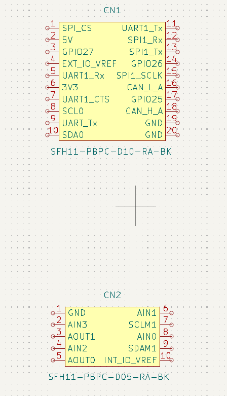
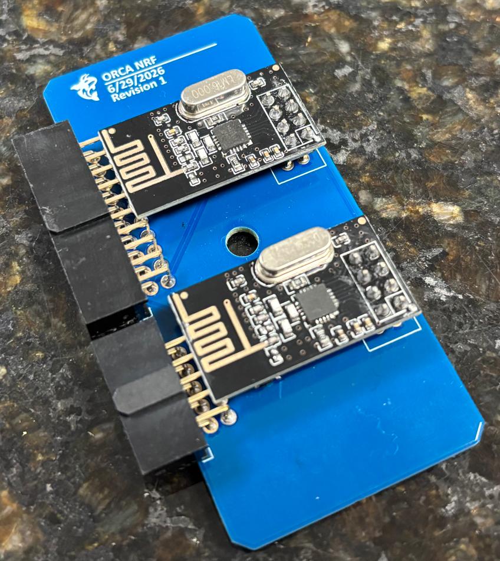
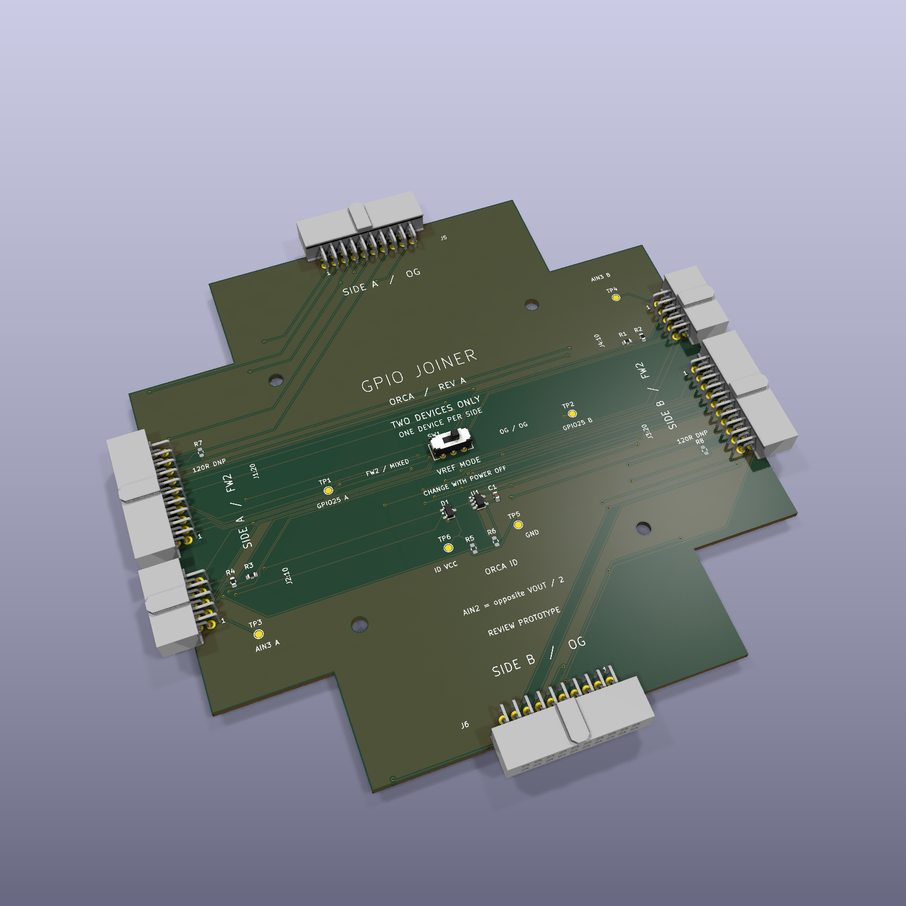

# fw2-orca-templates

Example project templates for the FreeWili 2 ORCA module.

Currently supports:

- [KiCad](./kicad) — schematic/PCB template (`ORCATemplate`)
- [Connector pinouts](./PINOUTS.md) — Free Wili OG and Free Wili 2 20-position and 10-position connector pin tables
- [ORCA_NRF example](./examples/ORCA_NRF) — example ORCA module board carrying an NRF24L01 radio
- [GPIO Joiner example](./examples/gpiojoiner) — a routed KiCad 10 star board for testing a pair of FreeWili 2 / OG devices, with fabrication and assembly files

## KiCad template

The `kicad/` directory contains a starter KiCad 7 project (`ORCATemplate`) for
building ORCA module boards, including a 3D `.step` model and a custom
`EEPROM.pretty` footprint library.

The ORCA module connects via two headers, `CN1` and `CN2`:

> **Note:** `kicad/fp-lib-table` currently references footprint libraries
> (`IDC_10`, `IDC_20`) by absolute path on another machine. Update these
> library paths (or replace them with the project-relative `${KIPRJMOD}`
> style used for `EEPROM`) before relying on the template on a fresh
> checkout.

## ORCA_NRF example

The `examples/ORCA_NRF/` directory contains a complete example ORCA module
project built from the template: an NRF24L01 radio carrier with the `CN1`
(20-pin) and `CN2` (10-pin) headers and the ID EEPROM.

User-provided photograph of the assembled ORCA NRF board.

> **Note:** The symbols and footprints are embedded in the schematic and PCB,
> so the project opens without extra libraries. The 3D model references in
> `ORCA_NRF.kicad_pcb` use absolute paths from another machine and will show
> as missing in the 3D viewer until you repoint them.

## GPIO Joiner example

[GPIO Joiner rev A](./examples/gpiojoiner) provides two opposing FreeWili 2
positions and two opposing OG positions. Connect one device per electrical
side, two devices total. A 24LC02BT ORCA EEPROM connects to shared FW2 I2C1.

The example includes editable KiCad sources, project-local symbols,
footprints and 3D models, top/bottom board images, a schematic PDF, and
[prototype manufacturing files](./examples/gpiojoiner/hardware/gpiojoiner/manufacturing/revA).
The [PCBWay quote-form answers](./examples/gpiojoiner/hardware/gpiojoiner/manufacturing/PCBWAY-QUOTE-ANSWERS.md)
show how to request five fully assembled prototypes.

This is an unbuilt prototype: physical mating, EEPROM ID programming and
bench operation remain to be validated. Optional R5-R8 models appear in the
preview but are DNP in the assembly BOM. See the example README for operating
limits and verification evidence.

Repository agent workflow is documented in [AGENTS.md](./AGENTS.md).
