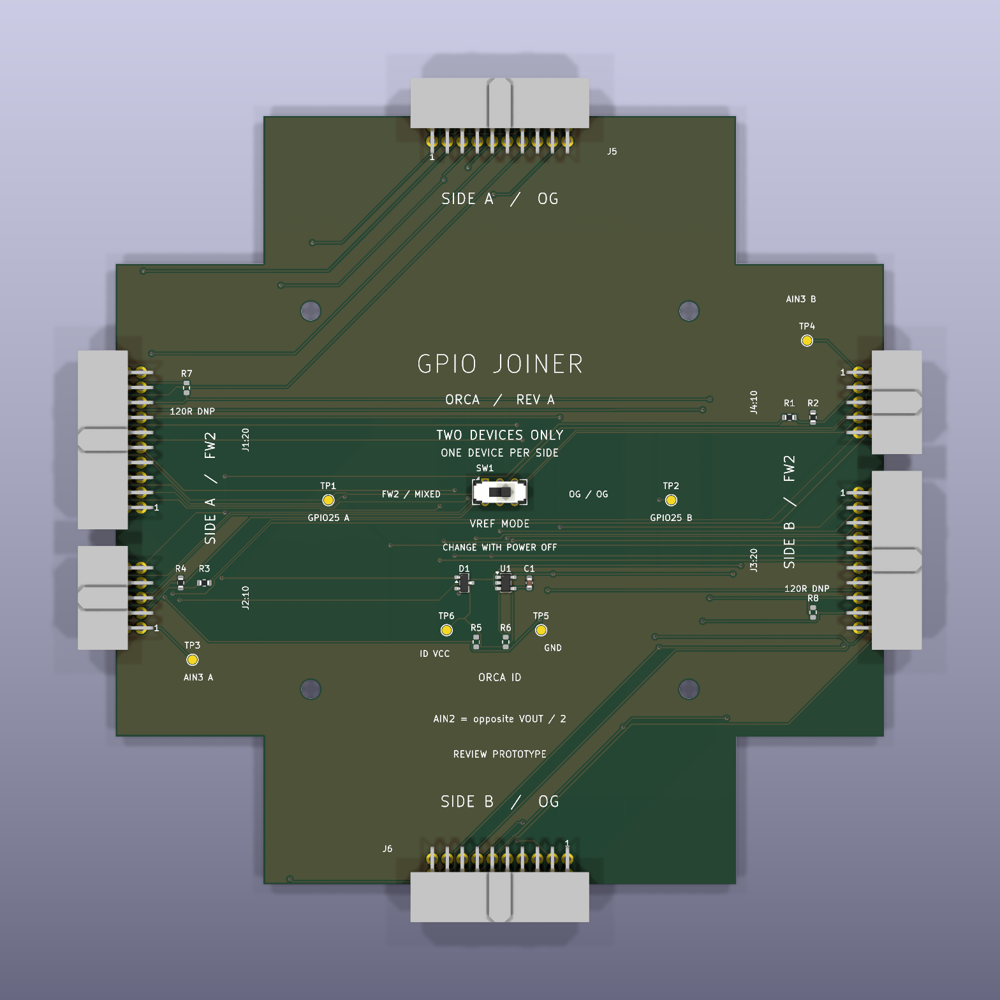
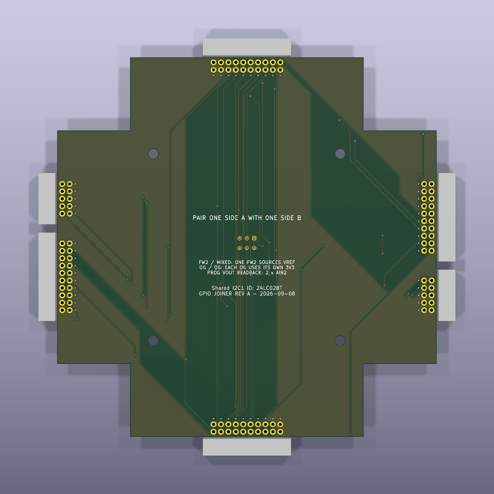

# FreeWili GPIO Joiner

KiCad project for a four-arm star test board with FW2 connectors opposite
each other and OG connectors on the perpendicular axis. Rev A supports
**two connected devices, one on Side A and one on Side B**, using either
generation on each side.

KiCad 3D preview of the routed prototype. Connector models show the board
layout; full device cases and physical mating have not been verified.
Optional R5-R8 models appear in these views but are DNP in the assembly BOM.

Open [gpiojoiner.kicad_pro](hardware/gpiojoiner/gpiojoiner.kicad_pro).
See the [board preview](hardware/gpiojoiner/previews/pcb-top.png),
[schematic PDF](hardware/gpiojoiner/previews/schematic.pdf), and
[setup instructions and BOM](hardware/gpiojoiner/README.md).

The required 24LC02BT ORCA EEPROM is connected to shared FW2 I2C1. VREF
mode is selected with a labeled switch. Programmable-output measurements
use 2:1 dividers, so test firmware must multiply the opposite AIN2 reading
by two. The original wiring authority remains [gpiojoiner spec.md](gpiojoiner%20spec.md).

Prototype manufacturing files for JLCPCB and PCBWay are prepared:
[Gerber ZIP](hardware/gpiojoiner/manufacturing/revA/gpiojoiner-revA-gerbers.zip),
[assembly package](hardware/gpiojoiner/manufacturing/revA/gpiojoiner-revA-assembly.zip),
and [order settings / fit check](hardware/gpiojoiner/manufacturing/revA/README.md).
The working quote is five fully assembled boards; no order has been placed.

This is a routed prototype. CAD verification is recorded in
[reports/verification.md](hardware/gpiojoiner/reports/verification.md).
Check actual device mating and supplier assembly previews before ordering.
EEPROM identification and bench validation remain required before production
release. Four simultaneously attached devices are unsupported by this revision.

| Top view | Bottom view |
| --- | --- |
|  |  |

The [PCBWay quote-form answers](hardware/gpiojoiner/manufacturing/PCBWAY-QUOTE-ANSWERS.md)
provide a field-by-field example for requesting a fully assembled prototype.
Agent workflow and board requirements are recorded in [AGENTS.md](AGENTS.md).
